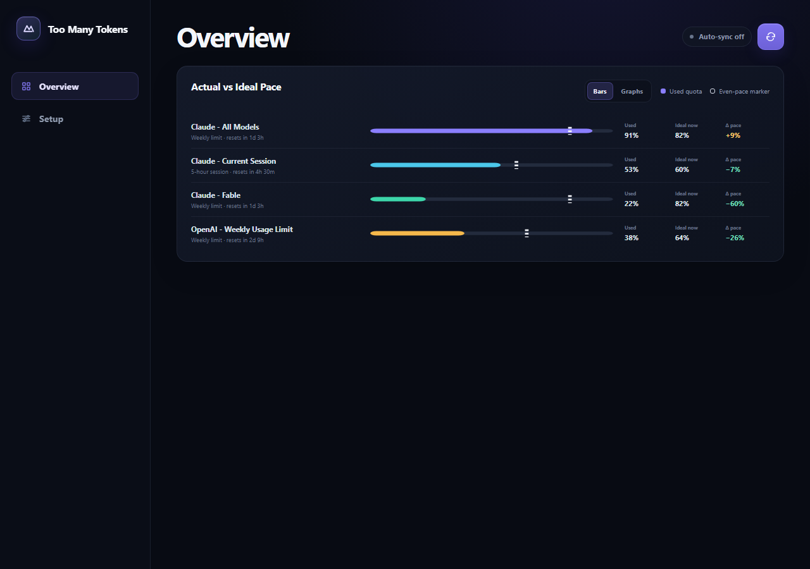

# Too Many Tokens

Know on Tuesday whether you're going to blow through your Claude or ChatGPT weekly limit by Thursday.



> ## Read this before you install it
>
> **This tool works in a way that Anthropic's and OpenAI's terms prohibit.** It is
> published for personal use, and using it may put your provider account at risk.
> That is your decision to make, and you should make it deliberately.
>
> To read your quota numbers, the extension **reloads your provider usage page and
> then reads the rendered text**. It does not passively observe a page you loaded
> yourself — it issues the page load itself, from a script, and repeats it on a
> timer when you start a run of scheduled refreshes.
>
> Both providers prohibit exactly that:
>
> - **Anthropic** ([Consumer Terms](https://www.anthropic.com/legal/consumer-terms), §3) — you must not "crawl, scrape, or otherwise harvest data or information from our Services other than as permitted under these Terms," nor, "[e]xcept when you are accessing our Services via an Anthropic API Key or where we otherwise explicitly permit it, ... access the Services through automated or non-human means, whether through a bot, script, or otherwise."
> - **OpenAI** ([Terms of Use](https://openai.com/policies/row-terms-of-use/), "What you cannot do") — you must not "[a]utomatically or programmatically extract data or Output."
>
> Terms change. Read the current versions yourself rather than trusting the quotes
> above, and satisfy yourself before you install this.
>
> **For balance, here is what it does not do.** It uses no API keys and no private
> or undocumented endpoints. It never handles your credentials — it reads a session
> you signed into yourself. It does not bypass authentication, captchas, paywalls,
> or rate limits, and it cannot help you exceed a quota; it only reports one. It
> reads no other user's data, sends nothing off your machine, and stores everything
> in your own browser. The conflict is with the automated-access clauses, not with
> the abuse or security clauses.
>
> **Nothing repeats in the background.** There is no always-on polling mode. A
> refresh run is something you start explicitly, it is capped at 10 refreshes no
> closer together than 5 minutes, and it stops on its own — see
> [Scheduled refreshes and request volume](#scheduled-refreshes-and-request-volume).
>
> Not affiliated with, endorsed by, or sponsored by Anthropic or OpenAI. "Claude"
> and "ChatGPT" are their respective owners' trademarks, used here only to say what
> this reads. Provided as-is under the [MIT License](LICENSE), without warranty —
> including no warranty that using it is consistent with any provider's terms.

## What this is

A browser-only dashboard for tracking LLM usage against session, daily, and weekly limits. A Chrome extension reloads the usage pages open in your signed-in browser, reads the rendered text, discovers every quota block on each page, and configures the corresponding dashboard entries automatically — see [the terms warning above](#read-this-before-you-install-it) for what that means for your provider account.

- **Local by default.** The tracker runs at `http://localhost:5074`. Configuration and usage data live in that origin's browser `localStorage`.
- **No application backend.** There is no account and no telemetry. Nothing you scan leaves your browser.
- **No clipboard access.** Scanned values travel only through a request-correlated bridge between the page and the extension.

The dashboard is a set of static files, so you can also [host your own copy](#deploy-your-own-copy) if you want the same tracker on more than one machine.

Use the same tracker address every time you reopen the dashboard. Browsers isolate `localStorage` by origin, so `localhost`, `127.0.0.1`, and any host you deploy to each have separate tracker data.

## Requirements

- Node.js 22 or newer to run the dashboard locally or build it for deployment.
- A Chromium-based browser if you want automatic provider-tab scanning.

## Run

From the repository root:

```powershell
npm start
```

Then open:

```text
http://localhost:5074
```

The server listens only on `127.0.0.1`. It exposes five browser assets: `index.html`, `styles.css`, `app.js`, `tracker-core.js`, and `providers.js`. Other repository files are not served.

## Install the Chrome extension

1. Open `chrome://extensions`.
2. Enable **Developer mode**.
3. Choose **Load unpacked**.
4. Select this repository's `chrome-extension` directory.
5. Start the tracker and refresh `http://localhost:5074` so its content bridge is present.

See [chrome-extension/README.md](chrome-extension/README.md) for permissions, communication, and troubleshooting details.

## Use

1. Open one or more provider usage pages in Chrome (currently Claude and OpenAI/ChatGPT — see [Supported providers](#supported-providers)).
2. On the dashboard, select the circular-arrows sync icon. The first sync selects every supported open tab, reloads the selected provider pages, waits for their current content, and scans them.
3. Review the generated pace rows on Overview. Each row's label, used percentage, ideal-by-now percentage, and reset countdown are filled from the provider page.
4. Open **Setup** to select provider tabs and show or hide individual readings. Start a bounded run of scheduled refreshes from **Overview**. These choices survive hard refreshes and page closes; a run in progress resumes with the count it had left.
5. Use **Manual Overrides** only when a provider changes its wording or you want a custom tracker.

On a typical Claude usage page, a single sync creates three independent trackers: the five-hour current session, the all-model weekly limit, and the named-model weekly limit. Text such as `82% remaining` is stored and displayed as `18% used`.

On OpenAI pages, controls such as **Day** are ignored unless they belong to an actual named quota — the date-range buttons are not themselves limits. Manual `Day` trackers and genuine daily limits are preserved.

Blocks whose only nearby text is a figure rather than a name — a promo reading `$0.00 spent`, say — are skipped too, since a tracker titled with a number tells you nothing and goes stale. Trackers you create yourself are never removed, whatever you call them.

Clicking the extension toolbar icon opens a small popup with **Refresh now** and **Open dashboard**. Refresh now asks the already-open dashboard to run its normal sync; the extension never scans or stores anything on its own, and it does not scrape into, read from, or write to the clipboard.

## Supported providers

The scraper's provider knowledge lives in one file, [`chrome-extension/providers.js`](chrome-extension/providers.js), which is also what the extension's `host_permissions` are generated from. Right now that's Claude (`claude.ai`) and OpenAI (`chatgpt.com`, `platform.openai.com`, and other `*.openai.com` usage routes).

The extension only asks Chrome for access to those specific sites — not to every page you visit. See [Permissions](#permissions-and-safety-boundaries) below.

## Features

- Dark responsive dashboard with remembered bar, graph, and runway views of actual-versus-ideal quota pace and projected time to depletion, grouped by provider. The runway view is a night-scene side view where the runway is the quota itself: your aircraft stands at how much is burned, a hollow ghost aircraft at where even pace would be, the runway ends at the wall where the quota runs dry, and a checkered post marks where the reset is projected to catch you — past the wall means running dry first. Positions, ground speed, and colour all come off measured numbers, a marker shows the previous projection, and a spent quota is drawn crashed into the wall while the reset post crawls back to it over exactly the remaining wait.
- Two focused pages: Overview for actual-versus-ideal pace, and Setup for provider connections, tracker visibility, and manual overrides.
- Multi-metric extraction: one Claude page can produce separate **Current session**, **All models**, and model-specific weekly limits.
- Percent-based and token-based run-rate calculations.
- Cycle pacing, remaining budget, token projection, and cost projection.
- Chrome tab discovery, explicit tab selection, one-off scans, and bounded runs of scheduled refreshes that stop on their own. Loading provider tabs remain visible while discovery is in progress. Each scan reloads the selected provider pages before reading them, including background tabs.
- Correlated extension requests using request IDs and explicit error responses.
- Scraper normalization for used or remaining percentages, token ratios, numeric suffixes such as `K`, `M`, and `B`, and reset schedules.
- Stable update identity based on the source URL plus quota metric, so several limits from one page remain independent and repeated scans update the right entry.
- Automatic session/daily/weekly cycle setup and cycle-hour derivation from parsed reset information.
- Bounded local usage history with five-minute sample coalescing for actual-pace graphs.
- Durable local preferences for tracker visibility, manual edits, Overview display mode, selected provider tabs, and the refresh run. Known Claude and OpenAI usage routes survive provider redirects without selecting unrelated tabs; a run in progress resumes after a hard refresh or page reopen and waits for temporarily closed provider tabs to return.

## Permissions and safety boundaries

- The page-to-extension bridge accepts messages only from the tracker origins listed in [`chrome-extension/tracker-origins.js`](chrome-extension/tracker-origins.js) — by default the fixed port-`5074` loopback origins (`localhost` and `127.0.0.1`). Origins are matched exactly, so a lookalike host cannot reach the bridge.
- Requests and responses carry matching request IDs, allowing overlapping operations to be correlated safely.
- Invalid requests, unavailable extension contexts, tab failures, and scrape failures return explicit errors rather than silently looking like empty results.
- Host permissions are limited to the specific providers the scraper supports, not every site you visit — see [Supported providers](#supported-providers). One tab's access being withheld does not stop the others from being scanned.
- The local Node server binds to loopback and uses a fixed asset allow-list; it is not a general-purpose static file server. The deployment package is generated from that same allow-list.

## Deploy your own copy

The dashboard is static files with no backend, so it can be hosted anywhere. Build the deployment package with:

```powershell
npm run build
```

The `dist` directory contains only the five public browser assets plus a `staticwebapp.config.json` for Azure Static Web Apps. Both the asset list and the security headers are read directly from `serve.js`, so a deployed copy serves exactly what the local server does, with the same no-store, content-security-policy, permissions-policy, referrer-policy, MIME-sniffing, and frame-denial headers. On a host other than Azure, apply those headers using whatever mechanism it provides.

To let the extension talk to your deployed origin, add it to `TRACKERS` in [`chrome-extension/tracker-origins.js`](chrome-extension/tracker-origins.js), then regenerate the manifest:

```powershell
npm run sync-manifest
```

Serve it over HTTPS. The bridge trusts every listed origin, so anything you add there can drive the extension on your machine.

## Test

Run the automated regression suite from the repository root:

```powershell
npm test
npm run check
```

## Scraping limitations

Provider usage pages are not standardized and can change without notice. The scraper uses text and metadata heuristics, so a scan can occasionally require a correction. Manual setup remains available as a collapsed fallback; it is not required for recognized session, daily, or weekly layouts.

## Scheduled refreshes and request volume

Every refresh **reloads** the selected provider tab and then reads it. That is a
real page load against the provider, so this is a request-volume decision, not just
a freshness one. There is deliberately no "poll forever" mode.

**A run is bounded and explicit.** On **Overview**, pick an interval and how many
refreshes, then press Start. The run performs at most that many refreshes and then
stops by itself. You can Stop or Restart it at any time, and changing either
setting restarts the run with the new values.

- **Interval:** minimum 5 minutes, default 15, maximum 60. The control only offers
  slower, never faster.
- **Count:** maximum 10 refreshes per run. A worst-case run is therefore 10 page
  loads over 50 minutes, after which nothing further happens until you start
  another one.
- **Starting a run does not scan.** The first refresh happens one interval later.
  Press **Sync** in the header if you want a single reading immediately.
- A run in progress survives reloading the dashboard and resumes with the count it
  had left. It cannot outlive that count.

**Both halves are enforced, and the extension does not trust the page.**
`chrome-extension/background.js` refuses to reload the same provider page more than
once every 5 minutes, whatever the dashboard asks for, and returns an explicit
rate-limit error instead. The cooldown is keyed on the page URL, so reopening the
tab grants no fresh allowance, and it is held in session storage so it survives the
service worker being evicted. Going faster than this means editing the extension as
well as the page — which is the point of it living in two places.

**One refresh is treated differently, and only one.** A click in the extension's
own popup is the single request Chrome can vouch for as coming from a person
rather than from a page, so it earns a shorter 60-second floor. That allowance is
recorded in the extension, expires in 30 seconds, and is spent by the first scan
that uses it. The dashboard cannot ask for it — if it could, an edited page would
ask for it every time and the 5-minute floor would mean nothing. This is what
makes a manual retry practical after you fix a signed-out provider tab, without
weakening the limit that applies to everything else.

The lowest-footprint way to use this is to not start a run at all and press Sync
when you actually want to know.

## Provider terms

See [Read this before you install it](#read-this-before-you-install-it) at the top.
In short: the extension reloads and reads your provider usage pages, both Anthropic
and OpenAI prohibit automated access and programmatic extraction, and using this may
put your account at risk. Nothing here is legal advice — read the providers' current
terms and decide for yourself.

## Contributing

See [CONTRIBUTING.md](CONTRIBUTING.md) for how to add a provider, run the tests, and what a good bug report looks like. Security issues go to [SECURITY.md](SECURITY.md) instead of a public issue.

## License

[MIT](LICENSE)
